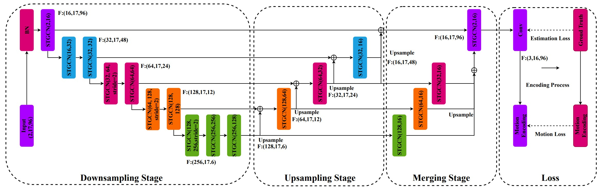

# UGCN: Motion Guided 3D Pose Estimation from Videos (ECCV 2020)

<a href="https://hits.seeyoufarm.com"></a>
</a>

<p align="center"></p>

This repo is the unofficial implementation of "[Motion Guided 3D Pose Estimation from Videos](https://arxiv.org/abs/2004.13985), Jingbo Wang, Sijie Yan, Yuanjun Xiong, Dahua Lin" in PyTorch. 

There are many omitted parts in the paper, so the "Conditional Directed Graph Convolution for 3D Human Pose Estimation" paper was referenced when implementing it. Therefore, note that there may be differences between actual papers and the way they are implemented. We welcome feedback on implementation errors.

## Abstract
We propose a new loss function, called motion loss, for the problem of monocular 3D Human pose estimation from 2D pose. In computing motion loss, a simple yet effective representation for keypoint motion, called pairwise motion encoding, is introduced. We design a new graph convolutional network architecture, U-shaped GCN (UGCN). It captures both short-term and long-term motion information to fully leverage the additional supervision from the motion loss. We experiment training UGCN with the motion loss on two large scale benchmarks: Human3.6M and MPI-INF-3DHP. Our model surpasses other state-of-the-art models by a large margin. It also demonstrates strong capacity in producing smooth 3D sequences and recovering keypoint motion.

## Dependencies

- Cuda 11.1
- Python 3.8.11
- Pytorch 1.9.0+cu111

## Dataset setup

Please download the dataset from [Human3.6M](http://vision.imar.ro/human3.6m/) website and refer to [VideoPose3D](https://github.com/facebookresearch/VideoPose3D) to set up the Human3.6M dataset ('./dataset' directory). 

```bash
${POSE_ROOT}/
|-- dataset
|   |-- data_3d_h36m.npz
|   |-- data_2d_h36m_cpn_ft_h36m_dbb.npz
```

## Test the model

To test on pretrained model on Human3.6M:

```bash
python main.py --reload --previous_dir 'checkpoint/pretrained'
```

Here, we compare our UGCN with recent state-of-the-art methods on Human3.6M dataset. Evaluation metric is Mean Per Joint Position Error (MPJPE) in mm​. 


|   Types   |   Models    |  MPJPE   |
| :-------: | :---------: | :------: |
|    TCN    | VideoPose3D |   46.8   |
|    ViT    | PoseFormer  |   44.3   |
|    ViT    |  MHFormer   |   43.0   |
|    GCN    | U-CondDGCN  |   43.4   |
|    GCN    |  **UGCN**   |  **45.6**  |


## Train the model

To train on Human3.6M:

```bash
python main.py --train --lr 0.005 --dropout 0.3 --lr_decay 0.1 --batch_size 256
```

## Citation

If you find our work useful in your research, please consider citing:

    @misc{wang2020motion,
        title={Motion Guided 3D Pose Estimation from Videos}, 
        author={Jingbo Wang and Sijie Yan and Yuanjun Xiong and Dahua Lin},
        year={2020},
        eprint={2004.13985},
        archivePrefix={arXiv},
        primaryClass={cs.CV}
    }

## Acknowledgement

Our code is extended from the following repositories. We thank the authors for releasing the codes. 

- [3d-pose-baseline](https://github.com/una-dinosauria/3d-pose-baseline)
- [3d_pose_baseline_pytorch](https://github.com/weigq/3d_pose_baseline_pytorch)
- [VideoPose3D](https://github.com/facebookresearch/VideoPose3D)
- [ST-GCN](https://github.com/vanoracai/Exploiting-Spatial-temporal-Relationships-for-3D-Pose-Estimation-via-Graph-Convolutional-Networks)
- [MHFormer](https://github.com/Vegetebird/MHFormer)

## Licence

This project is licensed under the terms of the MIT license.
